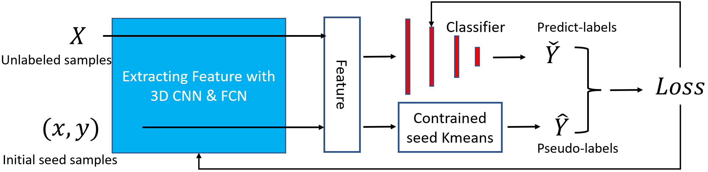
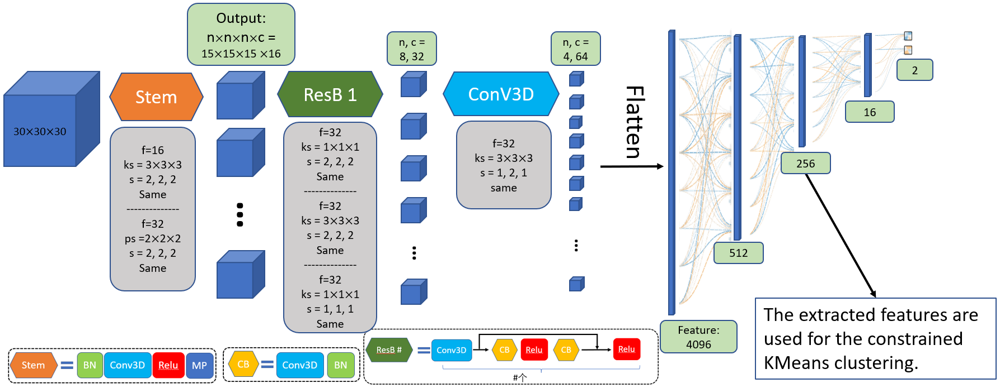

# SS-3D-Clump

## Overview
SS-3D-Clump is a deep learning model for the automatic verification of molecular clump candidates. It combines a 3D convolutional neural network (CNN) with a semi-supervised clustering algorithm to jointly learn the network parameters and cluster assignments of the generated features.

## Model Architecture
The SS-3D-Clump model consists of two main components:

1. Feature Extraction: This part of the model extracts deep features from the input data cubes representing the molecular clump candidates.

2. Clustering: The Constrained-KMeans algorithm is used to cluster the extracted features. The class labels obtained from clustering are used as supervision to update the weights of the entire network.

## Prerequisites
- Python 3.7
- TensorFlow 2.3
- NumPy
- Scikit-learn

## Usage
1. Clone the repository:
git clone https://github.com/Luoxiaoyu828/SS-3D-Clump.git

## Example
Please refer to the "example.py" file for a demonstration of how to use the SS-3D-Clump model on sample data.

## References
Link to the research paper (if available)
Any additional references or citations related to the SS-3D-Clump model
License
This project is licensed under the MIT License.

Feel free to use, modify, and distribute this model for research and educational purposes.

## Contact
If you have any questions or inquiries regarding the SS-3D-Clump model, please contact lxy@ctgu.edu.cn.

We appreciate any feedback or suggestions to improve the model.

## Acknowledgments
We would like to acknowledge the funding/support provided by **.

